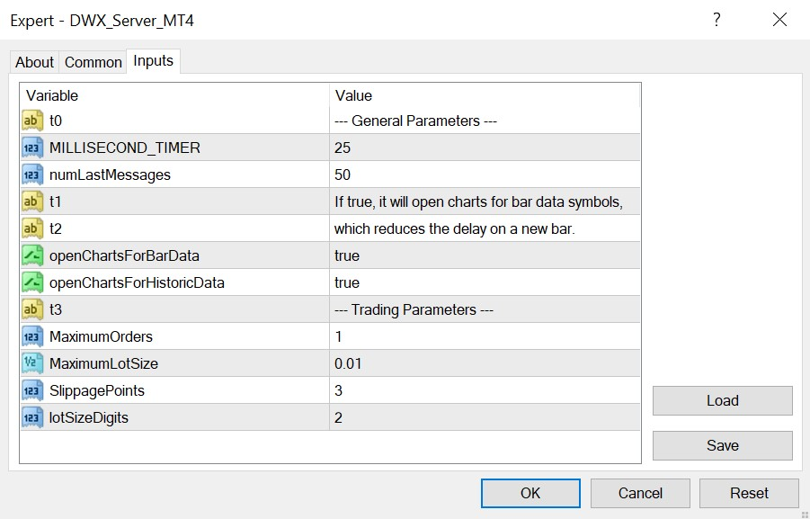

# DWX Connect - Seamlessly Link Any Trading Strategy to Darwinex

## Need help? Join the [Darwinex Collective Slack](https://join.slack.com/t/darwinex-collective/shared_invite/enQtNjg4MjA0ODUzODkyLWFiZWZlMDZjNGVmOGE2ZDBiZGI4ZWUxNjM5YTU0MjZkMTQ2NGZjNGIyN2QxZDY4NjUyZmVlNmU3N2E2NGE1Mjk) for code updates, Q&A and more.

## About Darwinex

[Darwinex](https://www.darwinex.com/?utm_source=github&utm_medium=dwx-connect-readme&utm_content=about-us-above-the-fold) is a **UK FCA-Regulated FinTech, Broker & Asset Manager**. We provide cost-effective access to Stocks, Futures, FX and CFDs via Trader Workstation (TWS), TWS API, FIX API, MetaTrader 4 and 5, and empower talented traders with the fastest route to attract investor capital and charge performance fees.

**Please take a moment to read our Risk Disclosure [here](https://www.darwinex.com/legal/risk-disclaimer?utm_source=github&utm_medium=zeromq-readme&utm_content=about-us-above-the-fold)**

**[Click here to visit our Trader Hall of Fame](https://www.darwinex.com/darwinia/hall-of-fame?utm_source=github&utm_medium=dwx-connect-readme&utm_content=about-us-above-the-fold)** * **ranked by Performance Fees earned (over €3 million paid to date)**

**[Click here to Open a Darwinex Trading Account](https://www.darwinex.com/register?utm_source=github&utm_medium=dwx-connect-readme&utm_content=about-us-above-the-fold)**

## Table of Contents
* [Introduction](#introduction)
* [Installation](#installation)
* [Configuration](#configuration)
* [Example Usage](#example-usage)
* [Video Tutorials](#video-tutorials)
* [Available functions](#available-functions)
* [License](#license) 

## Introduction

DWX Connect enables anyone to write trading strategies in any programming language and trade them at Darwinex. It provides functionality to subscribe to Tick and Bar data, as well as to Trade via MetaTrader 4 or 5 without having to code algorithms in MQL.

Its simple, file-based communication mechanism also provides an easy starting point for implementations in other programming languages. 

For simplicity, we will refer to the non-MQL side of this project as the "Python side" in this README.

## One-off Installation Steps

1. Please download the code from this GitHub repository. 

1. Download the MT4/MT5 Server EA (dwx_server_mt4.mq4 or dwx_server_mt5.mq5, depending on whether you're using MT4 or MT5) and copy it into the /MQL4/Experts or /MQL5/Experts directory (File -> Open Data Folder). 

1. Double click on the MT4/MT5 EA file to open it in MetaEditor. Press F7 to compile the file. Restart MT4/MT5 or Right-Click -> Refresh in the Navigator window. 

1. Attach the EA to any chart. Change the input parameters if needed, for example, MaximumOrders and MaximumLotSize if you want to trade larger sizes.

1. Open the file [dwx_client_example.py](python/dwx_client_example.py) and change the `MT4_files_dir` variable to the full path of the /MQL4/Files or /MQL5/Files directory. On Windows the path usually looks similar to this (`<username>` is your username):<br/>
  `C:/Users/<username>/AppData/Roaming/MetaQuotes/Terminal/3B534B10135CFEDF8CD1AAB8BD994B13/MQL4/Files`<br/><br/>
  However, on macOS it could look like this:<br/>
  `/Users/<username>/Library/Application Support/MetaTrader 4/Bottles/metatrader4/drive_c/Program Files/MetaTrader 4/MQL4/Files`<br/><br/>
  And on Linux like this:<br/>
  `/home/<username>/.wine/drive_c/Program Files (x86)/Darwinex MT4/MQL4/Files`

1. The example script will just try to subscribe to EURUSD and GBPUSD, and print some information on every tick. You can run the script with:
    ```console
    python dwx_client_example.py
    ```
    If you set open_test_trades=True, it will also open multiple test trades. 
    
    **Don't do this on a live account! It is best to [open a Darwinex demo account](https://www.darwinex.com/open-demo-trading-account) for testing.**

## Configuration

**MQL side:** For most applications it is only necessary to modify the two input parameters **MaximumOrders** and **MaximumLotSize**. 

The full list of input parameters for the MetaTrader Server EA (MT4 or MT5) is as follows:

- **MILLISECOND_TIMER** - The interval in which the EA checks for new prices and changes in the open orders (in milliseconds). 

- **numLastMessages** - The number of messages that will be stored in the message file. If it is too small, it could happen that the Python side misses a message. If it is too large, it could lead to higher CPU demand. Messages are mostly used for feedback and debug purposes, so they are not critical. 

- **openChartsForBarData** - If true, it will open charts for symbol/timeframe combinations that are subscribed to bar data. MetaTrader does not automatically update all bar data in the background instantly. By having the charts open, we force MetaTrader to update the data more quickly reducing the delay on a new bar. 

- **openChartsForHistoricData** - Same as the last parameter, but for symbol/timeframe combinations for which a request for historic data was sent. 

- **MaximumOrders** - The maximum number of orders allowed. If the maximum number of orders is open and an order is sent from the Python side, it will not open the order, but return an error message. 

- **MaximumLotSize** - The maximum lot size allowed for a single order (not all orders together). 

- **SlippagePoints** - This value will be used in the OrderSend() function. This is usually ignored by the broker, but still available as a parameter for completeness. 

- **lotSizeDigits** - The digits to which the lot size should be rounded. The default is 2 for Forex symbols. But if you trade Stocks or Indices there could be symbols that do not allow lot sizes as small as 0.01. 



**Python side:** 
- **sleep_delay** - The time interval in which the Python side will check the files (in seconds). The default value is0.005 (5 milliseconds). 

- **max_retry_command_seconds** - If you send multiple commands in a short time, it could happen that the Python side is not able to write to the command file when the mql side is just reading it. The parameter `max_retry_command_seconds` can be used to define the period in which the Python side will retry to send the commend.

- **load_orders_from_file** - If true, it will load the orders from a file on initialization. Otherwise it would trigger the on_order_event() function after a restart of the Python program if there are any open orders because it would not know about them. However, it will only know the last state that was sent to the Python side. If the mql server EA is turned off during order operations, it would only notice them when both are turned on again. 

- **verbose** - If true, it will print more debug information. 

## Example Usage

The best way to get started is to use the [example DWX_Connect client](python/dwx_client_example.py). 

It defines various functions which can be used to react to data changes from MetaTrader:

- **on_tick(symbol, bid, ask)** - is triggered every time the Python side registers a change in the current bid/ask prices. For easier access the symbol and the current bid/ask prices are passed along. However, you can also always access them through self.dwx.market_data from any other function. 

- **on_bar_data(symbol, time_frame, time, open_price, high, low, close_price, tick_volume)** - is triggered when the Python side registers new bar data.

- **on_historic_data(symbol, time_frame, data)** - is triggered when the Python side registers a response from a historic data request. 

- **on_historic_trades()** - is triggered when the Python side registers a response from a historic trades request. The historic trades can be accessed via self.dwx.historic_trades.

- **on_message(message)** - is triggered when the Python side registers a new message from MetaTrader. The message is a dictionary with a 'type' that can either be 'INFO' or 'ERROR'. Error messages have an 'error_type' and a 'description' while info messages only contain a 'message'.

## Video Tutorials

Click the image below to watch a live demonstration of DWX Connect:

[](https://www.youtube.com/watch?v=rbApdnEyJxw "DWX Connect: Seamlessly Link Any Trading Strategy to Darwinex")

## Available Functions:

**Stored Information:**

The following dictionaries can be used to access the available information directly (e.g. through self.dwx.open_orders):
- `open_orders` - contains the open orders. The order ticket is used as the key for this dictionary. 
- `account_info` - contains the account information such as account name, number, equity, balance, leverage and free margin. 
- `market_data` - contain the current bid/ask prices for all subscribed symbols as well as the tick value. 
- `bar_data` - contains the latest bar data. This is updated continually if subscribed to specific bar data. 
- `historic_data` - contains the latest historic data, which is only updated after a request for historic data.
- `historic_trades` - contains the requested trade history, which is only updated after a request for historic trades. 

**Data Functions:**
- `subscribe_symbols(symbols)` - subscribes to tick data for a list of symbols. Example format: `symbols = ['EURUSD', 'GBPUSD']`
- `subscribe_symbols_bar_data(symbols)` - subscribes to bar data for a list of symbol/timeframe combinations. Example format: `symbols=[['EURUSD', 'M15'], ['GBPUSD', 'H4']]`
- `subscribe_symbols(symbols)` - subscribes to tick data for a list of symbols. Example format: `symbols = ['EURUSD', 'GBPUSD']`
- `get_historic_data(symbol, time_frame, start, end)` - requests historic bar data. The arguments `start` and `end` are given as timestamp. 
- `get_historic_trades(lookback_days)` - requests the trade history for the last x days. Keep in mind that in MetaTrader the complete trade history should be visible in the Account History tab. 

**Order Functions:**

In MT4 the term 'order' refers to both, pending orders and filled positions. 

To keep the functionality consistent between Python/MT4/MT5, we also do not differentiate between pending orders and positions on the Python side. 

Filled positions are just orders with type 'buy' or 'sell'. 

- `open_order(symbol, order_type, lots, price, stop_loss, take_profit, magic, comment, expriation)` - sends a request to open an order. 
   - Order types: 'buy', 'sell', 'buylimit', 'selllimit', 'buystop', 'sellstop'
   - If the price is empty, it will use the current bid/ask price (only works for market buy/sell orders). 
   - Most of the arguments are not strictly necessary. For example, `open_order('EURUSD', 'buy', 0.01)` would send a buy order without stop loss or take profit and magic number 0 if not specified. 
- `modify_order(ticket, lots, price, stop_loss, take_profit, expriation)` - modifies an order with a given ticket. Except `price` all arguments have to be present to not get deleted. For example, if `stop_loss` is not provided, it would set the stop loss to 0, thereby removing any existing stop loss. 
- `close_order( ticket, lots)` - closes an order with a given ticket. The `lots` argument can be used to partially close a position, whereas `close_order(ticket)` would close the complete position (or pending order).
- `close_all_orders()`  - closes all open orders.
- `close_orders_by_symbol(symbol)`  - closes all open orders with a given symbol.
- `close_orders_by_magic(magic)`  - closes all open orders with a given magic number.

## License

BSD 3-Clause License

Copyright (c) 2019, Darwinex.
All rights reserved.

Redistribution and use in source and binary forms, with or without
modification, are permitted provided that the following conditions are met:

* Redistributions of source code must retain the above copyright notice, this
  list of conditions and the following disclaimer.

* Redistributions in binary form must reproduce the above copyright notice,
  this list of conditions and the following disclaimer in the documentation
  and/or other materials provided with the distribution.

* Neither the name of the copyright holder nor the names of its
  contributors may be used to endorse or promote products derived from
  this software without specific prior written permission.

THIS SOFTWARE IS PROVIDED BY THE COPYRIGHT HOLDERS AND CONTRIBUTORS "AS IS"
AND ANY EXPRESS OR IMPLIED WARRANTIES, INCLUDING, BUT NOT LIMITED TO, THE
IMPLIED WARRANTIES OF MERCHANTABILITY AND FITNESS FOR A PARTICULAR PURPOSE ARE
DISCLAIMED. IN NO EVENT SHALL THE COPYRIGHT HOLDER OR CONTRIBUTORS BE LIABLE
FOR ANY DIRECT, INDIRECT, INCIDENTAL, SPECIAL, EXEMPLARY, OR CONSEQUENTIAL
DAMAGES (INCLUDING, BUT NOT LIMITED TO, PROCUREMENT OF SUBSTITUTE GOODS OR
SERVICES; LOSS OF USE, DATA, OR PROFITS; OR BUSINESS INTERRUPTION) HOWEVER
CAUSED AND ON ANY THEORY OF LIABILITY, WHETHER IN CONTRACT, STRICT LIABILITY,
OR TORT (INCLUDING NEGLIGENCE OR OTHERWISE) ARISING IN ANY WAY OUT OF THE USE
OF THIS SOFTWARE, EVEN IF ADVISED OF THE POSSIBILITY OF SUCH DAMAGE.
